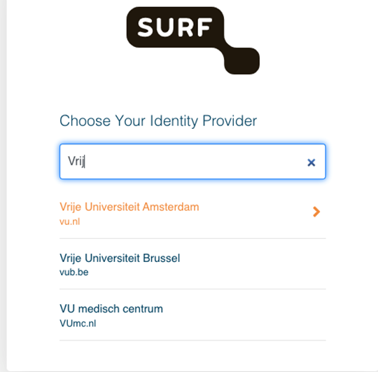

# Create your account on SRC

This manual shows you how to get access to the (Jupyter Hub) workspace/environment on the Surf research cloud.

After creating your own account, you will:
- Get your own account (i.e., your own Jupyter Lab environment).
- Have access to our shared memory (e.g. 1.5TB) where the forcing data is available in `/data/volume_2/`. 
- All changes in your local home Jupyter lab environment will be stored (if you save them) after you log-out.

1. First you will have to become a member of our research cloud collaboration (e.g. ecoextreml-nlesc). Please click on the invitation link and you will be redirected to a login page.
2. If your institution is there (as shown below)*, you will be redirected to your institutional login page and there you can login with your institute credentials. 
    * Most EU universities are connected (such as ETH and institutes in the Netherlands), but I think not for institutes outside of the Netherlands such as DLR or the Norwegian Computing Center.
    * If you’re institute is not in the list, you can create a guest eduID (NL) account. Type guest in the search bar and select eduID.

3. Follow the instructions after login. Accept conditions and click "Ziet er goed uit, verder" (meaning "looks good, continue").
4. Click on "Vraag lidmaatschap voor ecoextreml-nlesc" (meaning "Request membership for ecoextreml-nlesc").
5. Now write a motivation, tick the conditions and click "Aanvragen" (meaning "Request").
Your request is now pending! The administrators will receive an email and accept your request!

After 